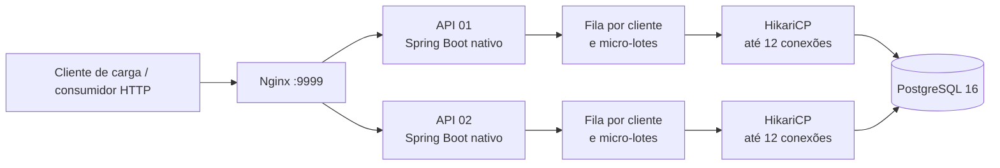
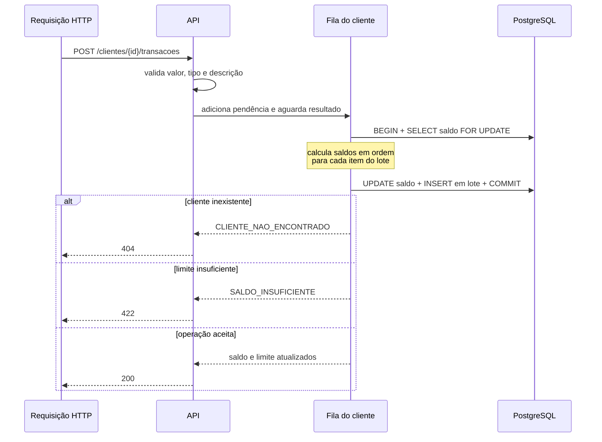
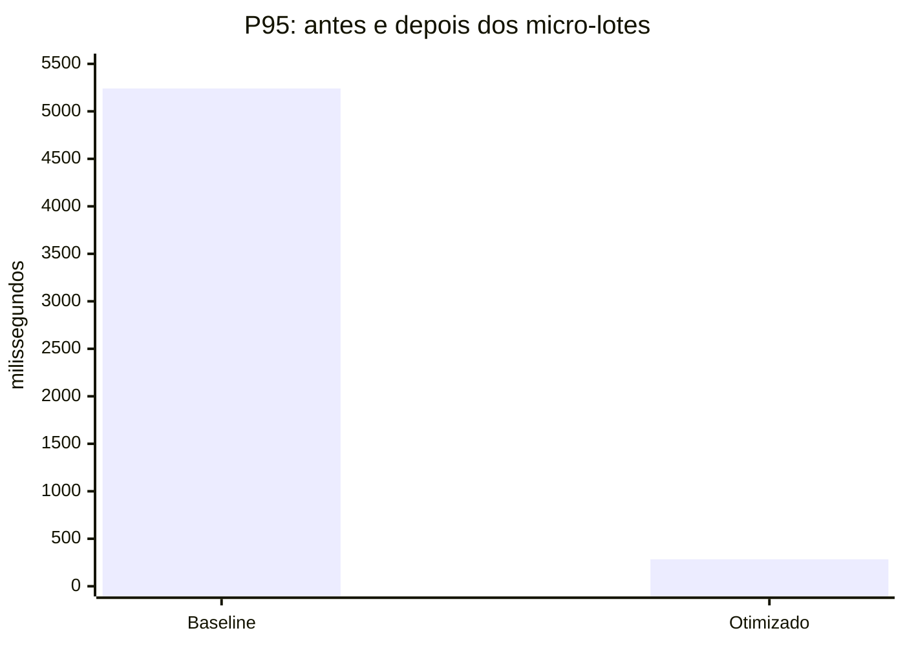

# Rinha de Backend 2024/Q1 — Spring Boot

Implementação da **Rinha de Backend 2024/Q1** com Java 21, Spring Boot, imagem nativa GraalVM, PostgreSQL e Nginx.

O projeto expõe uma API de transações e extratos para cinco clientes pré-cadastrados. A prioridade da implementação é preservar a consistência do saldo sob concorrência intensa, dentro do orçamento de recursos da competição.

> Este repositório é disponibilizado sob uma licença proprietária e restritiva. Consulte [LICENSE](LICENSE).

## Visão geral



| Componente | Responsabilidade |
|---|---|
| Nginx | Ponto público, balanceamento entre as duas instâncias e conexões persistentes ao upstream. |
| APIs | Validação HTTP, regras de negócio, mapeamento de erros e execução das operações SQL. |
| PostgreSQL | Fonte de verdade para clientes, saldo corrente e histórico de transações. |

O `docker-compose.yml` mantém o orçamento total da Rinha: **1,5 CPU** e **525 MB**.

| Serviço | CPU | Memória |
|---|---:|---:|
| api01 | 0,36 | 125 MB |
| api02 | 0,36 | 125 MB |
| nginx | 0,18 | 150 MB |
| PostgreSQL | 0,60 | 125 MB |
| **Total** | **1,50** | **525 MB** |

## Endpoints

### `POST /clientes/{id}/transacoes`

Registra um crédito ou débito.

```json
{
  "valor": 1000,
  "tipo": "d",
  "descricao": "compra"
}
```

Respostas:

| Status | Significado |
|---:|---|
| `200` | Transação registrada; devolve `limite` e `saldo`. |
| `404` | Cliente inexistente. |
| `422` | Corpo inválido ou débito que ultrapassa o limite. |

### `GET /clientes/{id}/extrato`

Retorna saldo, limite, horário do extrato e as últimas dez transações do cliente.

## Consistência em concorrência e micro-lotes

O Nginx roteia cada cliente sempre para a mesma API. Nessa API, requisições pendentes daquele cliente são agrupadas — até 32 por lote — e processadas na ordem da fila. O lote abre uma transação curta no PostgreSQL, bloqueia o saldo do cliente, calcula individualmente quais débitos são permitidos, atualiza o saldo uma vez e insere todos os lançamentos aceitos em lote.



O lock `FOR UPDATE` protege a leitura e a atualização do saldo durante todo o lote. Como o saldo é calculado sequencialmente dentro da mesma transação, um débito jamais é aceito além do limite. O roteamento melhora a eficiência, mas a segurança não depende dele: duas APIs ainda seriam serializadas pelo lock da linha no PostgreSQL.

### Fluxo interno do processamento

```mermaid
flowchart TD
    R[POST /clientes/{id}/transacoes] --> V{Bean Validation}
    V -- inválido --> U[422]
    V -- válido --> K[Nginx extrai id da URI\ne aplica hash consistente]
    K --> Q[ConcurrentLinkedQueue\ndo cliente]
    Q --> W[Um dos 5 workers\nretira até 32 pendências]
    W --> L[TransactionTemplate]
    L --> S[SELECT saldo e limite\nFOR UPDATE]
    S --> E{Cliente existe?}
    E -- não --> N[Completa futures com 404]
    E -- sim --> C[Calcula crédito/débito\nna ordem recebida]
    C --> D[UPDATE saldos uma vez]
    D --> I[batch INSERT transacoes\nreWriteBatchedInserts]
    I --> M[COMMIT]
    M --> O[Completa cada future\ncom 200 ou 422]
```

O request HTTP aguarda somente o `CompletableFuture` associado à sua própria pendência. As respostas continuam individuais: cada uma recebe o saldo resultante da sua posição na sequência, mesmo que várias tenham sido persistidas no mesmo commit.

### Alterações aplicadas

| Área | Alteração | Motivo |
|---|---|---|
| Nginx | `hash $cliente_routing_key consistent` usando o ID extraído da URI. | Mantém a fila de cada cliente em uma única API e reduz disputa cruzada. |
| API | `BatchingTransacaoProcessor` com cinco workers e lotes de até 32 comandos. | Amortece o pico de requisições e evita um commit por request. |
| Banco | `SELECT ... FOR UPDATE`, cálculo ordenado, um `UPDATE` e `batch INSERT` por lote. | Mantém limite e saldo corretos com menos locks, round-trips e commits. |
| JDBC | `reWriteBatchedInserts`, cache de prepared statements e `prepareThreshold=3`. | Reutiliza planos e envia os inserts do lote de forma eficiente. |
| Spring | Remoção de `@Transactional` dos caminhos de uma única instrução SQL. | Evita `BEGIN`/`COMMIT` explícitos desnecessários; a instrução permanece atômica em autocommit. |
| PostgreSQL | `synchronous_commit=off`, `jit=off` e cache de 1.000 IDs da sequência. | Reduz espera de WAL, custo de compilação e sincronização da sequência no benchmark. |
| Recursos | PostgreSQL: 0,40 → 0,60 CPU; APIs: 0,46 → 0,36 CPU cada. | Direciona CPU ao componente que efetivamente serializa e persiste as operações. |

```mermaid
erDiagram
    CLIENTES ||--|| SALDOS : possui
    CLIENTES ||--o{ TRANSACOES : registra

    CLIENTES {
        int id PK
        varchar nome
        int limite
    }
    SALDOS {
        int id PK
        int cliente_id UK
        int valor
    }
    TRANSACOES {
        int id PK
        int cliente_id
        int valor
        char tipo
        varchar descricao
        timestamptz realizada_em
    }
```



## Como executar

Pré-requisitos: Docker, Docker Compose e Java 21 para executar os testes locais.

```bash
./build-image.sh
docker compose up
```

A API fica disponível em `http://localhost:9999`.

Para encerrar os containers:

```bash
docker compose down
```

## Testes

```bash
./gradlew test
```

Além de testes de serviço e controller, o projeto possui um teste de integração com Testcontainers que envia débitos concorrentes ao mesmo cliente. Ele confirma que apenas os débitos permitidos são aceitos e que o saldo e o histórico final permanecem coerentes.

## Resultado de carga registrado

O cenário oficial de crédito da Rinha foi executado por **4 min e 4 s** antes e depois do pacote de otimizações. Ambas as execuções concluíram as 61.503 requisições sem erro; a diferença está na eliminação da fila de latência.

| Métrica | Baseline | Com micro-lotes | Ganho |
|---|---:|---:|---:|
| Requisições | 61.503 | 61.503 | — |
| Erros | 0 | 0 | — |
| Vazão média | 251,03 req/s | 251,03 req/s | mantida |
| Tempo médio | 2.542 ms | **64 ms** | **-97,5%** |
| P50 | 2.662 ms | **7 ms** | **-99,7%** |
| P95 | 5.241 ms | **284 ms** | **-94,6%** |
| P99 | 6.482 ms | **382 ms** | **-94,1%** |
| Máximo | 7.353 ms | **515 ms** | **-93,0%** |
| Abaixo de 800 ms | 12.826 (21%) | **61.503 (100%)** | **meta atingida** |

| Grupo | P50 | P95 | P99 | Máximo | Média |
|---|---:|---:|---:|---:|---:|
| Validações | 11 ms | 72 ms | 77 ms | 79 ms | 20 ms |
| Extratos | 5 ms | 293 ms | 394 ms | 496 ms | 57 ms |
| Créditos | 8 ms | 285 ms | 385 ms | 515 ms | 65 ms |
| Débitos | 7 ms | 282 ms | 381 ms | 512 ms | 64 ms |



O resultado otimizado cumpre a meta: **todas as requisições completaram em menos de 800 ms**, mantendo taxa de 251 req/s e zero respostas incorretas.

## Aprendizados e decisões de desempenho

### O pool de conexões é um limite de concorrência, não um acelerador

Elevar indiscriminadamente o HikariCP de 12 para 16 conexões por API criou mais sessões concorrendo pelas mesmas linhas de saldo e levou a esgotamento do pool, timeouts e respostas `504`. O tamanho atual limita a pressão sobre o banco e mantém as threads HTTP alinhadas ao número de conexões.

### O hot spot são cinco saldos

O teste concentra operações em apenas cinco clientes. Escritas para um mesmo cliente precisam ser serializadas para manter o saldo correto; portanto, adicionar conexões não remove essa dependência. Quando a taxa de chegada supera a capacidade de processar essas filas, a latência cresce junto com o número de usuários ativos.

### Backpressure é preferível a falhas prematuras

O Tomcat aceita conexões em fila e o Nginx mantém timeouts compatíveis com a carga. Isso evitou que uma fila temporária se transformasse imediatamente em `500`, `504` ou erro de aquisição de conexão. A contrapartida é que fila excessiva aumenta a latência; por isso, capacidade sustentável continua sendo a métrica principal.

### A transação deve ser atômica e curta

A transação do lote contém a leitura com lock, a atualização do saldo e os inserts do histórico. Não há leitura e escrita independentes que possam sofrer condição de corrida. Para transações isoladas, o CTE SQL legado também permanece atômico. O índice `(cliente_id, realizada_em DESC, id DESC)` mantém o extrato das últimas dez transações eficiente.

### Reduzir commits e round-trips aumenta a capacidade

As APIs removem a transação Spring redundante das operações de uma única instrução e usam autocommit nesse caso. Nos micro-lotes, vários lançamentos compartilham um único commit. O driver PostgreSQL reutiliza prepared statements e reescreve inserts em lote; a sequência de transações usa cache de 1.000 IDs, pois lacunas no identificador não têm impacto funcional.

### Ajustes de PostgreSQL devem respeitar o orçamento

O banco usa buffers e memória de trabalho modestos, número máximo de conexões compatível com os pools e `synchronous_commit=off`. A última opção reduz a espera por flush de WAL e preserva atomicidade para sessões ativas, mas pode perder transações recentemente confirmadas em uma queda abrupta do PostgreSQL. É uma decisão de desempenho deliberada para este ambiente de benchmark.

### Estado atual e cuidados operacionais

O PostgreSQL recebeu 0,60 CPU e cada API ficou com 0,36 CPU, preservando o teto de 1,5 CPU. A meta de 800 ms foi atingida no cenário registrado. Nas próximas alterações, devem ser monitorados P50/P95, erros, tamanho efetivo dos lotes e uso de CPU do banco. Aumentar pools de conexão não é recomendado sem nova medição, pois amplia a contenção nas cinco linhas de saldo.

## Licença

Copyright © 2026. Todos os direitos reservados.

O código não pode ser usado, copiado, modificado, distribuído, sublicenciado ou explorado comercialmente sem autorização prévia e expressa do titular. Consulte o arquivo [LICENSE](LICENSE) para os termos completos.
