# Rinha de Backend 2024/Q1 — Spring Boot

Implementação da **Rinha de Backend 2024/Q1** com Java 21, Spring Boot, imagem nativa GraalVM, PostgreSQL e Nginx.

O projeto expõe uma API de transações e extratos para cinco clientes pré-cadastrados. A prioridade da implementação é preservar a consistência do saldo sob concorrência intensa, dentro do orçamento de recursos da competição.

> Este repositório é disponibilizado sob uma licença proprietária e restritiva. Consulte [LICENSE](LICENSE).

## Visão geral

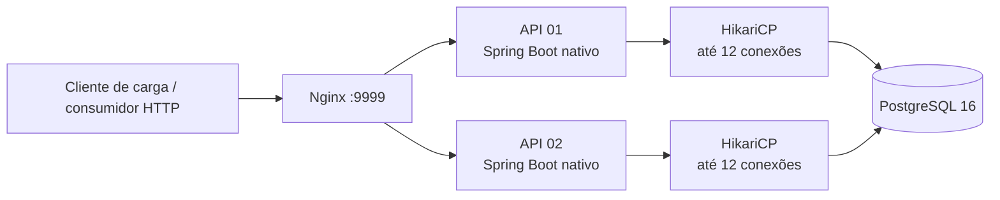

| Componente | Responsabilidade |
|---|---|
| Nginx | Ponto público, balanceamento entre as duas instâncias e conexões persistentes ao upstream. |
| APIs | Validação HTTP, regras de negócio, optimistic locking e persistência via Spring Data JDBC. |
| PostgreSQL | Fonte de verdade para clientes, saldo corrente e histórico de transações. |

O `docker-compose.yml` mantém o orçamento total da Rinha: **1,5 CPU** e **525 MB**.

| Serviço | CPU | Memória |
|---|---:|---:|
| api01 | 0,46 | 125 MB |
| api02 | 0,46 | 125 MB |
| nginx | 0,18 | 150 MB |
| PostgreSQL | 0,40 | 125 MB |
| **Total** | **1,50** | **525 MB** |

## Endpoints

### `POST /clientes/{id}/transacoes`

Registra um crédito ou débito.

```json
{
  "valor": 1000,
  "tipo": "d",
  "descricao": "compra"
}
```

Respostas:

| Status | Significado |
|---:|---|
| `200` | Transação registrada; devolve `limite` e `saldo`. |
| `404` | Cliente inexistente. |
| `422` | Corpo inválido ou débito que ultrapassa o limite. |
| `503` | Os conflitos concorrentes excederam o limite de retries. |

### `GET /clientes/{id}/extrato`

Retorna saldo, limite, horário do extrato e as últimas dez transações do cliente.

## Racional de concorrência e carga

Há somente cinco linhas de saldo que recebem escrita. Portanto, o gargalo não é “falta de conexões”: é a ordem das operações concorrentes sobre essas cinco linhas. Quando cada `POST` executava sua própria transação, duas réplicas podiam ler o mesmo saldo, disputar o `@Version` e repetir todo o fluxo. Sob carga, os retries consumiam threads, conexões e memória; o Nginx passou a aguardar conexão com a API ou o primeiro header da resposta até devolver `504`.

A solução final desloca a serialização inevitável para a aplicação, onde ela é barata e explícita. O banco continua sendo a fonte de verdade e mantém optimistic locking como proteção entre processos, mas não é mais usado como fila de trabalho.

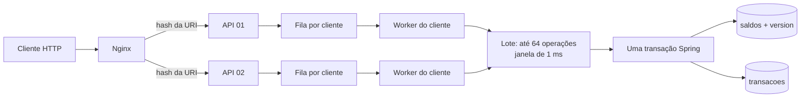

### Fluxo do `POST /clientes/{id}/transacoes`

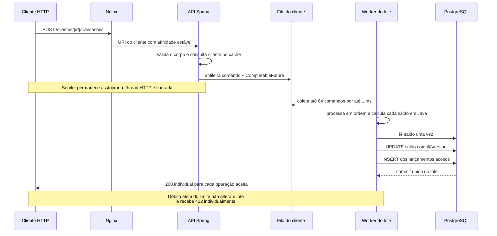

O worker de um cliente processa os comandos na ordem de chegada. Para cada comando, calcula o próximo saldo usando o saldo já calculado para o item anterior. Assim, um débito sem limite é rejeitado com `422`, mas não impede créditos ou outros débitos válidos do mesmo lote. Ao final, há no máximo um `UPDATE` de saldo para o lote e um `INSERT` por lançamento aceito.

Se outra instância gravar o mesmo saldo apesar da afinidade, o `UPDATE ... WHERE version = ?` gerado pelo Spring Data JDBC falha. A transação inteira é desfeita e o lote é reprocessado em uma nova transação, no máximo 12 vezes. Portanto, o `@Version` é a garantia residual de consistência; fila, lote e afinidade são o caminho normal de desempenho.

### Fluxo do `GET /clientes/{id}/extrato`

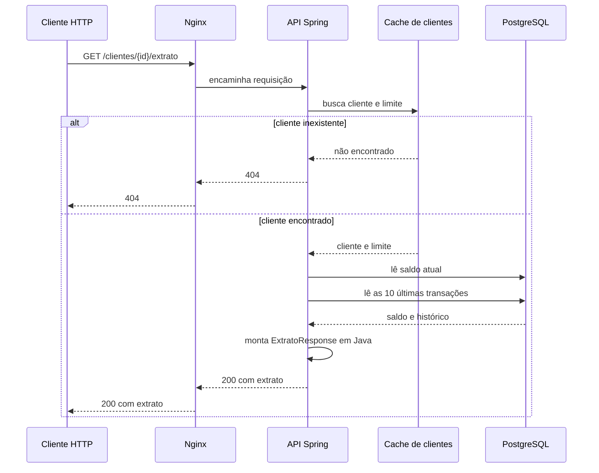

O extrato usa transação somente leitura com isolamento `REPEATABLE_READ`: saldo e histórico são montados a partir de uma visão consistente, sem entrar na fila de escrita dos lotes.

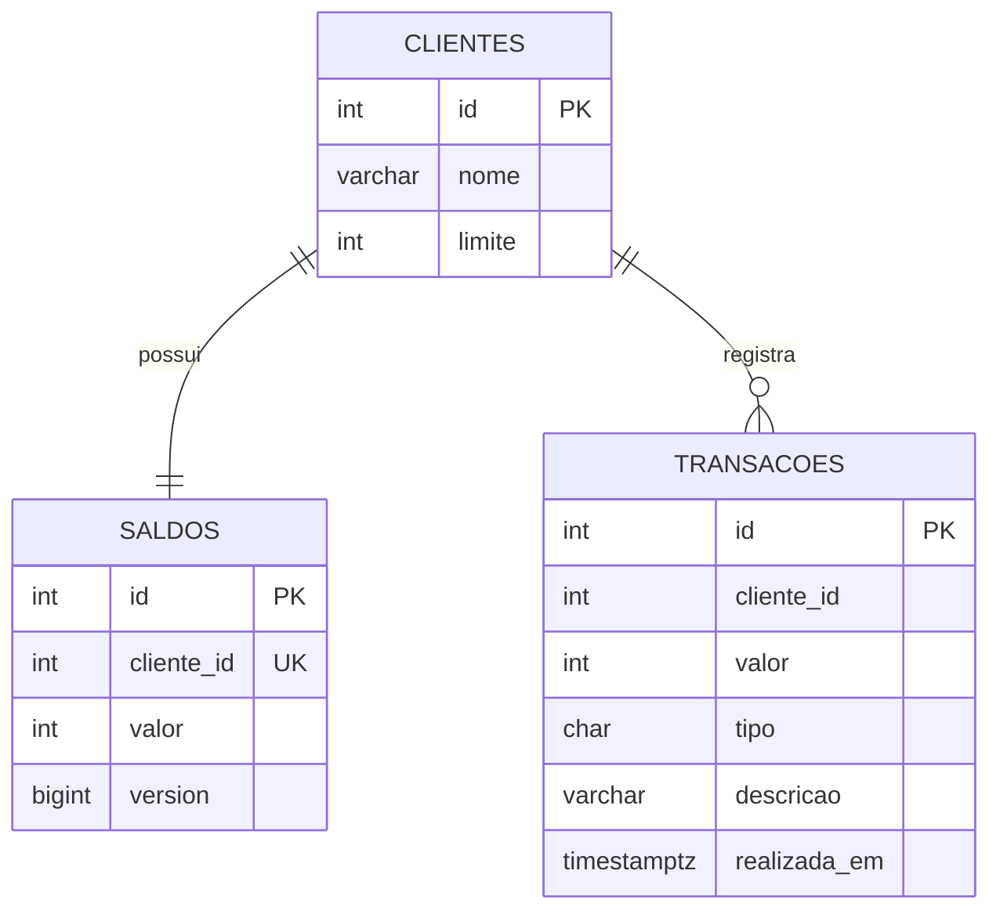

## Como executar

Pré-requisitos: Docker, Docker Compose e Java 21 para executar os testes locais.

```bash
./build-image.sh
docker compose up
```

A API fica disponível em `http://localhost:9999`.

Para encerrar os containers:

```bash
docker compose down
```

## Testes

```bash
./gradlew test
```

Além de testes de serviço e controller, o projeto possui um teste de integração com Testcontainers que envia débitos concorrentes ao mesmo cliente. Ele confirma que apenas os débitos permitidos são aceitos e que o saldo e o histórico final permanecem coerentes.

## Resultado de carga registrado

Os dois cenários abaixo foram executados localmente com a mesma carga da Rinha: 61.503 requisições, sendo 19.860 créditos, 39.660 débitos, 1.860 extratos e 123 validações.

| Métrica | Antes do batching | Arquitetura final | Melhoria |
|---|---:|---:|---:|
| Requisições | 61.503 | 61.503 | — |
| Erros | 36 `504` | **0** | eliminados |
| Vazão média | 242,14 req/s | **250,01 req/s** | +3% |
| Tempo médio | 2.712 ms | **153 ms** | 17,7× menor |
| P50 | 678 ms | **71 ms** | 9,5× menor |
| P75 | 2.282 ms | **210 ms** | 10,9× menor |
| P95 | 14.137 ms | **582 ms** | 24,3× menor |
| P99 | 35.093 ms | **939 ms** | 37,4× menor |
| Máximo | 54.781 ms | **1.883 ms** | 29,1× menor |

O cenário “antes” já tinha cache de cliente e afinidade no Nginx, mas ainda gravava cada transação isoladamente. Ele melhorou leituras repetidas, porém continuou acumulando usuários ativos e chegou a `504` por espera de conexão/header no upstream. O cenário final removeu essa fila crescente: nenhum `504`, P99 abaixo de 1 segundo e todos os 61.503 requests concluídos corretamente.

Nos resultados finais, créditos e débitos permaneceram equilibrados: créditos tiveram P95 de 593 ms e débitos P95 de 586 ms. Extratos tiveram P95 de 295 ms. Isso confirma que a otimização de escrita não degradou o caminho de leitura.

Os números são uma referência de execução local; CPU, Docker, versão do PostgreSQL e perfil da máquina influenciam o resultado.

### Evidências visuais do Gatling

Resumo consolidado da execução, sem erros:

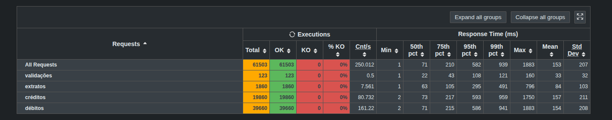

O tráfego injetado permaneceu estável, enquanto as respostas acompanharam a carga sem formar uma fila crescente:

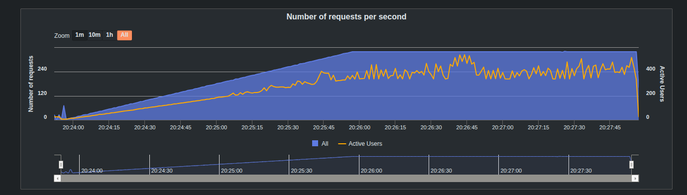

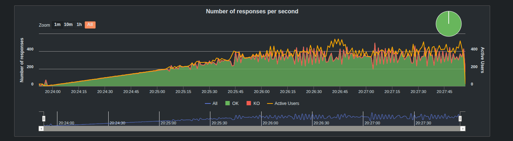

Os usuários ativos permanecem limitados, e os percentis não apresentam a rampa contínua de dezenas de segundos observada antes do batching:

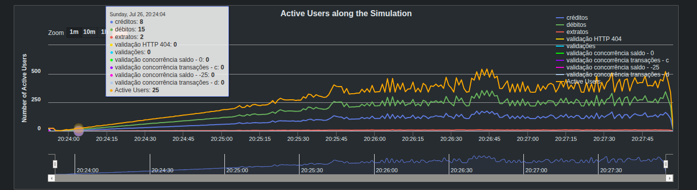

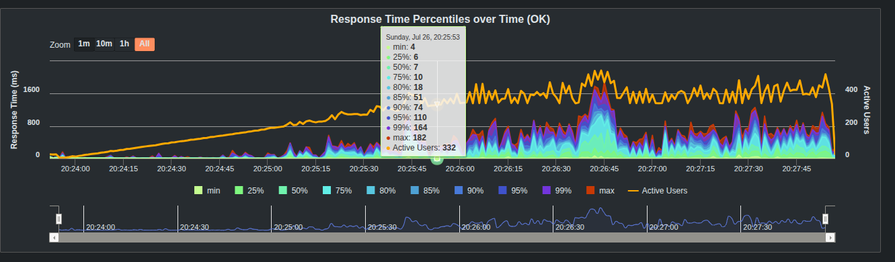

Distribuição e faixas de tempo de resposta:

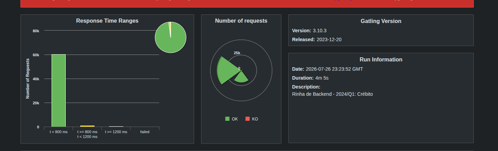

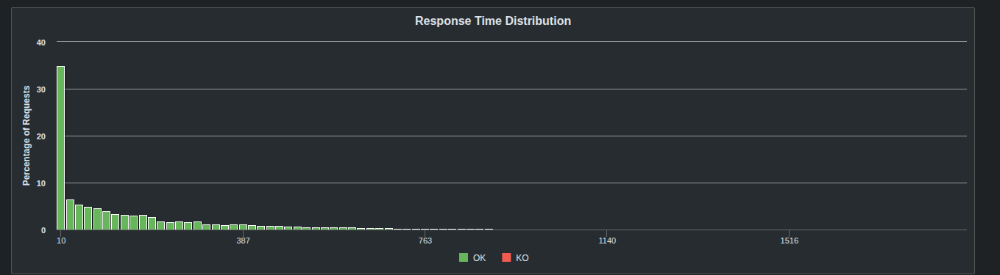

## Decisões que levaram ao resultado

| Sinal observado | Decisão | Racional e efeito |
|---|---|---|
| Mesmo limite era lido a cada `POST` | Cachear `Cliente` e `limite` | Os cinco clientes são imutáveis nesse domínio. A operação passa a consultar o saldo, não os dados estáticos do cliente. |
| O mesmo cliente podia cair em réplicas diferentes | Hash da URI no Nginx | Mantém a maioria das escritas de um cliente na mesma API, reduzindo conflitos distribuídos. |
| Cada lançamento fazia um update de saldo | Fila e batching por cliente | Um lote produz um único update do saldo final, preserva ordem e reduz a parte mais concorrida do fluxo. |
| Threads HTTP aguardavam banco/retry | `CompletableFuture` e MVC assíncrono | O servlet aceita e enfileira rapidamente; a thread HTTP não fica bloqueada enquanto o lote espera ou grava. |
| Filas grandes esgotavam memória | Limites explícitos | Tomcat aceita até 1.024 conexões e 256 pendências por API; cada cliente possui fila de até 256 comandos. |
| Ainda pode haver escrita concorrente entre processos | `@Version` + retry limitado | Mantém atomicidade sem usar SQL manual; conflitos raros repetem o lote inteiro em nova transação. |
| Diagnóstico estava misturado a `422` válidos | Log Nginx apenas para `5xx` | Logs agora destacam timeout/falha de infraestrutura, não débitos corretamente recusados. |

### O que deliberadamente não foi feito

- Aumentar HikariCP: mais conexões não aumentam a capacidade de atualizar as mesmas cinco linhas e aumentariam a disputa no banco.
- Aumentar timeouts: apenas esconderia a fila e elevaria a memória usada por requisições pendentes.
- Voltar à CTE PostgreSQL manual: o resultado foi alcançado usando aggregates, repositories, `@Version` e transações do Spring Data JDBC.
- Usar `@Query` ou SQL nativo para a operação crítica: a persistência continua baseada em métodos derivados e `save`/`saveAll` do Spring Data JDBC.

### Limites e operação

O lote tem tamanho máximo de 64 e janela de coleta de 1 ms. São limites deliberadamente pequenos: reduzem escrita repetida sem transformar uma operação isolada em espera perceptível. A fila por cliente tem 256 entradas para respeitar os 125 MB de cada API; se estiver cheia, a aplicação responde com `503` controlado em vez de acumular memória indefinidamente.

## Licença

Copyright © 2026. Todos os direitos reservados.

O código não pode ser usado, copiado, modificado, distribuído, sublicenciado ou explorado comercialmente sem autorização prévia e expressa do titular. Consulte o arquivo [LICENSE](LICENSE) para os termos completos.
