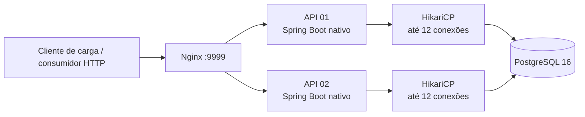
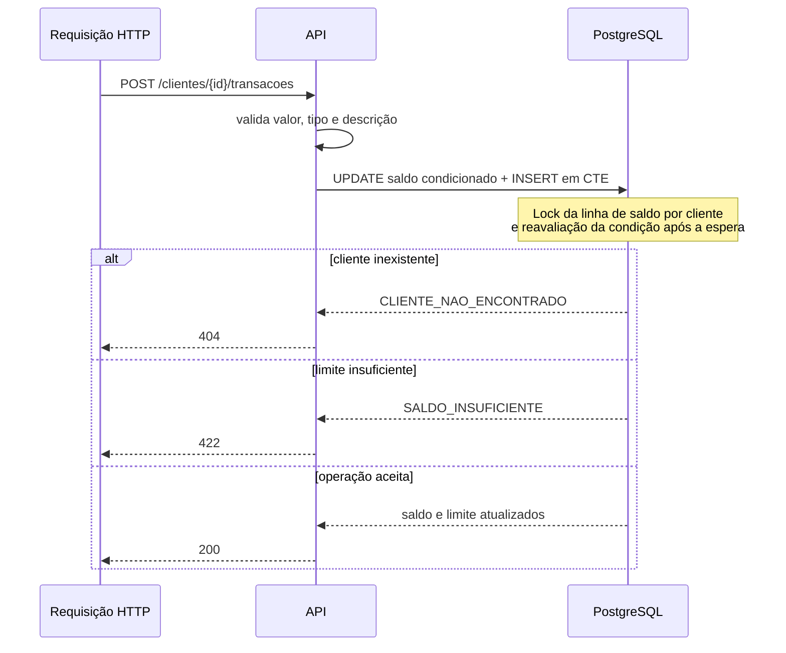
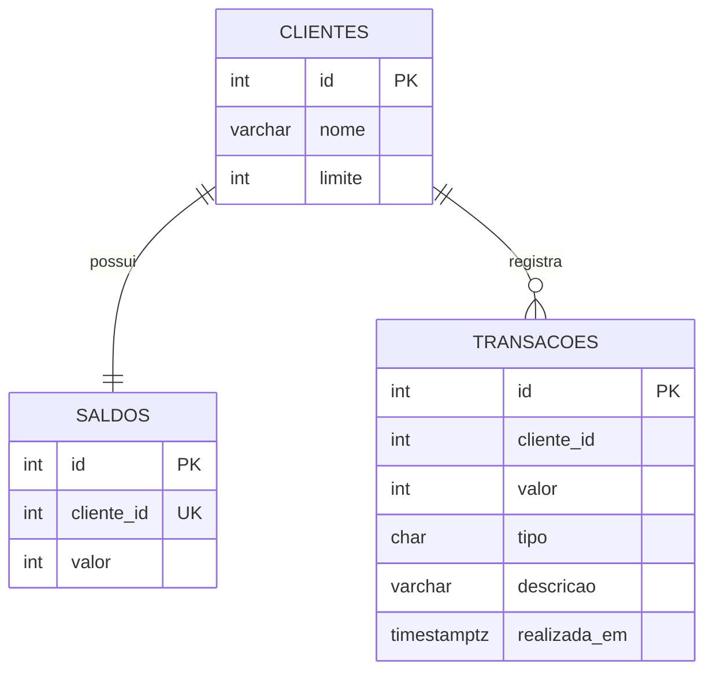

# Rinha de Backend 2024/Q1 — Spring Boot

Implementação da **Rinha de Backend 2024/Q1** com Java 21, Spring Boot, imagem nativa GraalVM, PostgreSQL e Nginx.

O projeto expõe uma API de transações e extratos para cinco clientes pré-cadastrados. A prioridade da implementação é preservar a consistência do saldo sob concorrência intensa, dentro do orçamento de recursos da competição.

> Este repositório é disponibilizado sob uma licença proprietária e restritiva. Consulte [LICENSE](LICENSE).

## Visão geral



| Componente | Responsabilidade |
|---|---|
| Nginx | Ponto público, balanceamento entre as duas instâncias e conexões persistentes ao upstream. |
| APIs | Validação HTTP, regras de negócio, mapeamento de erros e execução das operações SQL. |
| PostgreSQL | Fonte de verdade para clientes, saldo corrente e histórico de transações. |

O `docker-compose.yml` mantém o orçamento total da Rinha: **1,5 CPU** e **525 MB**.

| Serviço | CPU | Memória |
|---|---:|---:|
| api01 | 0,46 | 125 MB |
| api02 | 0,46 | 125 MB |
| nginx | 0,18 | 150 MB |
| PostgreSQL | 0,40 | 125 MB |
| **Total** | **1,50** | **525 MB** |

## Endpoints

### `POST /clientes/{id}/transacoes`

Registra um crédito ou débito.

```json
{
  "valor": 1000,
  "tipo": "d",
  "descricao": "compra"
}
```

Respostas:

| Status | Significado |
|---:|---|
| `200` | Transação registrada; devolve `limite` e `saldo`. |
| `404` | Cliente inexistente. |
| `422` | Corpo inválido ou débito que ultrapassa o limite. |

### `GET /clientes/{id}/extrato`

Retorna saldo, limite, horário do extrato e as últimas dez transações do cliente.

## Consistência em concorrência

Uma transação é processada por uma única instrução SQL: atualiza o saldo apenas quando o limite permite, insere o lançamento somente se a atualização ocorreu e devolve o estado final.



O predicado do débito usa o valor da linha que está sendo atualizada. Isso é essencial: quando uma sessão espera o lock de `saldos`, o PostgreSQL reavalia a condição com o saldo mais recente, evitando que débitos concorrentes ultrapassem o limite.



## Como executar

Pré-requisitos: Docker, Docker Compose e Java 21 para executar os testes locais.

```bash
./build-image.sh
docker compose up
```

A API fica disponível em `http://localhost:9999`.

Para encerrar os containers:

```bash
docker compose down
```

## Testes

```bash
./gradlew test
```

Além de testes de serviço e controller, o projeto possui um teste de integração com Testcontainers que envia débitos concorrentes ao mesmo cliente. Ele confirma que apenas os débitos permitidos são aceitos e que o saldo e o histórico final permanecem coerentes.

## Resultado de carga registrado

No cenário oficial de crédito da Rinha, a configuração atual concluiu todas as requisições sem erro:

| Métrica | Resultado |
|---|---:|
| Requisições | 61.503 |
| Erros | 0 |
| Vazão média | 251,03 req/s |
| Tempo médio | 2.542 ms |
| P50 | 2.662 ms |
| P95 | 5.241 ms |
| P99 | 6.482 ms |
| Máximo | 7.353 ms |
| Abaixo de 800 ms | 12.826 (21%) |

Esse resultado é uma referência de uma execução local: hardware, Docker, versão do banco e carga concorrente influenciam diretamente os números.

## Aprendizados e decisões de desempenho

### O pool de conexões é um limite de concorrência, não um acelerador

Elevar indiscriminadamente o HikariCP de 12 para 16 conexões por API criou mais sessões concorrendo pelas mesmas linhas de saldo e levou a esgotamento do pool, timeouts e respostas `504`. O tamanho atual limita a pressão sobre o banco e mantém as threads HTTP alinhadas ao número de conexões.

### O hot spot são cinco saldos

O teste concentra operações em apenas cinco clientes. Escritas para um mesmo cliente precisam ser serializadas para manter o saldo correto; portanto, adicionar conexões não remove essa dependência. Quando a taxa de chegada supera a capacidade de processar essas filas, a latência cresce junto com o número de usuários ativos.

### Backpressure é preferível a falhas prematuras

O Tomcat aceita conexões em fila e o Nginx mantém timeouts compatíveis com a carga. Isso evitou que uma fila temporária se transformasse imediatamente em `500`, `504` ou erro de aquisição de conexão. A contrapartida é que fila excessiva aumenta a latência; por isso, capacidade sustentável continua sendo a métrica principal.

### A transação deve ser atômica e curta

A atualização do saldo e o `INSERT` no histórico estão na mesma operação SQL e na mesma transação Spring. Não há leitura e escrita separadas na aplicação que possam sofrer condição de corrida. O índice `(cliente_id, realizada_em DESC, id DESC)` mantém o extrato das últimas dez transações eficiente.

### Ajustes de PostgreSQL devem respeitar o orçamento

O banco usa buffers e memória de trabalho modestos, número máximo de conexões compatível com os pools e `synchronous_commit=off`. A última opção reduz a espera por flush de WAL e preserva atomicidade para sessões ativas, mas pode perder transações recentemente confirmadas em uma queda abrupta do PostgreSQL. É uma decisão de desempenho deliberada para este ambiente de benchmark.

### Próximos experimentos

Para reduzir a parcela acima de 800 ms, a primeira experiência recomendada é redistribuir CPU das APIs para o PostgreSQL, sem ultrapassar 1,5 CPU no total. Ganhos maiores exigirão mudança arquitetural, como roteamento estável por cliente e fila/batching por cliente, sempre mantendo a ordem e a atomicidade das operações.

## Licença

Copyright © 2026. Todos os direitos reservados.

O código não pode ser usado, copiado, modificado, distribuído, sublicenciado ou explorado comercialmente sem autorização prévia e expressa do titular. Consulte o arquivo [LICENSE](LICENSE) para os termos completos.
